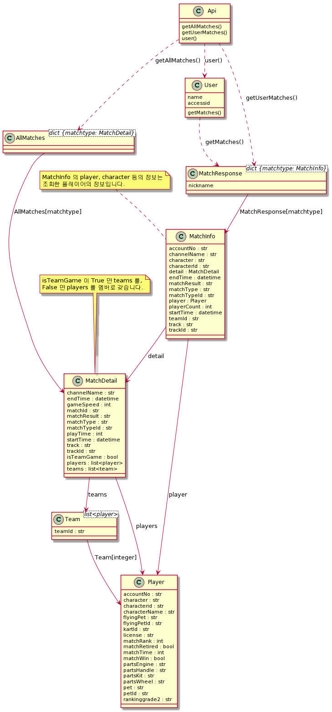

=============================
KartRider.py
=============================

---------------------
시작하기 전에
---------------------

이 라이브러리는 카트라이더의 OpenAPI를 파이썬으로 래핑한 라이브러리입니다.
사용하기 위해선 OpenAPI 의 API Key가 필요합니다.
`OpenAPI docs <https://developers.nexon.com/kart/apiList>`__ 도 참고해 보세요.

라이브러리의 모든 날짜는 UTC 기준입니다.

| 파라미터로 입력되는 날짜(startTime, endTime 등)의 포맷은 '%Y-%m-%d %H:%M:%S' 입니다.
| 예시 : 2020-01-01 13:03:33

설치하기
====================

::

   > pip install KartRider
   > python -m KartRider -d DOWNLOAD_DIR

경로를 지정해서 메타데이터를 다운로드 받으세요.

::

   import KartRider
   KartRider.set_metadatapath(DOWNLOAD_DIR)

위와 같이 메타데이터의 경로를 설정합니다.

::

   api = KartRider.Api(API_KEY)

API KEY는 공개적으로 저장하지 마세요.

----------------------------
튜토리얼
----------------------------

특정 아이디의 최근 10 매치 불러오기
====================================

.. code-block:: python

    import KartRider

    KartRider.set_metadatapath(META_PATH)
    api = KartRider.Api(API_KEY)

    nickname = '닉네임'

    matches = api.user(nickname).getMatches(limit=10)

    games = matches
    for gametypeid, match in games.items():

        gametype = KartRider.getgameTypes()[gametypeid]

        for game in match:
            print('게임 : {}, 캐릭터 : {}, 카트 : {}, 맵 : {}, 순위 : {}, 날짜 : {}'
                .format(gametype,game.player.character, game.player.kart,
                        game.track, game.player.matchRank, game.startTime))

가장 최근 매치의 상세 정보 불러오기
====================================
.. code-block:: python

    import KartRider

    KartRider.set_metadatapath(META_PATH)
    api = KartRider.Api(API_KEY)

    allmatches = api.getAllMatches(limit=10)

    gametypegames = list(allmatches.values())
    game = gametypegames[0][0]

    print('게임 : {} , 채널 이름 : {}, 트랙 이름 : {}'
          .format(game.matchType, game.channelName, game.track))

    if game.isTeamGame:
        i = 0
        for players in game.team:
            print('{}팀 :'.format(i))
            for player in players:
                print('닉네임 : {}, 캐릭터 : {}, 카트 : {}, 순위 : {}, 리타이어 여부 : {}'
                      .format(player.characterName, player.character, player.kart,
                              player.matchRank, player.matchRetired))
            i += 1

    else:
        for player in game.players:
                print('닉네임 : {}, 캐릭터 : {}, 카트 : {}, 순위 : {}, 리타이어 여부 : {}'
                      .format(player.characterName, player.character, player.kart,
                              player.matchRank, player.matchRetired))

----------------------------
레퍼런스
----------------------------

라이브러리의 uml 입니다.

Api 클래스
===========================

.. automodule:: KartRider.apiwrapper
   :members:
   :undoc-members:
   :show-inheritance:

매치 데이터
==========================

.. automodule:: KartRider.match
   :members:
   :undoc-members:
   :show-inheritance:

유저 데이터
==========================

.. automodule:: KartRider.user
   :members:
   :undoc-members:
   :show-inheritance:

메타 데이터
===========================

.. automodule:: KartRider.metadata
   :members:
   :undoc-members:
   :show-inheritance:
